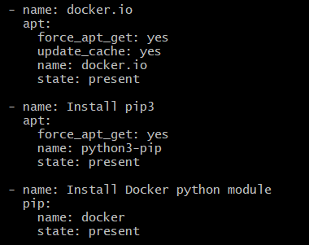

## Automated ELK Stack Deployment

The files in this repository were used to configure the network depicted below.

These files have been tested and used to generate a live ELK deployment on Azure. They can be used to either recreate the entire deployment pictured above. Alternatively, select portions of the Ansible file may be used to install only certain pieces of it, such as Filebeat.

  - [Install ELK Ansible](install-elk.yml)
  - [Ansible Playbook Filebeat](filebeat-playbook.yml)
  - [Ansible Playbook Metricbeat](metricbeat-playbook.yml)

This document contains the following details:
- Description of the Topology
- Access Policies
- ELK Configuration
  - Beats in Use
  - Machines Being Monitored
- How to Use the Ansible Build

### Description of the Topology

The main purpose of this network is to expose a load-balanced and monitored instance of DVWA, the Damn Vulnerable Web Application.

Load balancing ensures that the application will be highly available, in addition to restricting unauthorized access to the network.
- What aspect of security do load balancers protect? What is the advantage of a jump box?
	* Load balancers distribute traffic across multiple servers, whether it is network or application traffic. This traffic distribution defends against DDoS attacks.
	* A jump box is the hardened internet-facing server, which prevents virtual machines within its network from exposure to the public. This becomes the remote entry point to the rest of the virtual machines on the network, meaning all admins must connect through this machine prior to performing other network tasks. 

Integrating an ELK server allows users to easily monitor the vulnerable VMs for changes to the logs and system system traffic.
- Filebeat watches for log files and their location, and sends this information to Logstash or Elasticsearch to be indexed.
- Metricbeat monitors machine/service metrics.

The configuration details of each machine may be found below.

| Name     | Function | IP Address | Operating System |
|----------|----------|------------|------------------|
| Jump Box | Gateway/Ansible  | 10.0.0.4   | Linux (ubuntu 18.04)           |
| Web-1    | Docker-DVMA  | 10.0.0.5   | Linux (ubuntu 18.04)           |
| Web-2    | Docker-DVMA | 10.0.0.6   | Linux   (ubuntu 18.04)         |
| Web-3    | Docker-DVMA  | 10.0.0.7   | Linux   (ubuntu 18.04)         |
| ELK      |ELK Server    | 10.2.0.4   | Linux   (ubuntu 18.04)         |

### Access Policies

The machines on the internal network are not exposed to the public Internet. 

Only the Jump Box machine can accept connections from the Internet. Access to this machine is only allowed from the following IP addresses:
- Personal IP Address 

Machines within the network can only be accessed by the Jump Box, IP 10.0.0.4.
- Which machine did you allow to access your ELK VM? What was its IP address?
	* Only the Jump Box (IP 10.0.0.4) can access the ELK VM. However, the security is configured to allow TCP traffic to the ELK Server from Personal IP

A summary of the access policies in place can be found in the table below.

| Name     | Publicly Accessible | Allowed IP Addresses |
|----------|---------------------|----------------------|
| Jump Box | Yes                 | Personal IP          |
| Web-1    | No                  | 10.0.0.4             |
| Web-2    | No                  | 10.0.0.4             |
| Web-3    | No                  | 10.0.0.4             |
| Elk      | No                  | Personal IP, 10.0.0.4|

### Elk Configuration

Ansible was used to automate configuration of the ELK machine. No configuration was performed manually, which is advantageous because...
- you are able to manage configuration and deploy to several servers at once, all from the command line after initial playbook configuration. This makes the task of configuration not only extremely efficient, but also greatly reduces human error induced configuration variability between servers. 

The playbook implements the following tasks:

- Installs these services:
	* docker.io
	* python3-pip
	* docker (python pip module)
	
    
- Increases virtual memory for the virtual machine used to run ELK
	
    
- Downloads and launches elk container and maps to these ports: 5601, 9200, 5044 
	
	

The following screenshot displays the result of running `docker ps` after successfully configuring the ELK instance.

### Target Machines & Beats
This ELK server is configured to monitor the following machines:
- 10.0.0.5
- 10.0.0.6
- 10.0.0.7

We have installed the following Beats on these machines:
- Filebeat
- Metricbeat

These Beats allow us to collect the following information from each machine:
- Filebeat generates and organizes log files that are then forwarded to Logstash and Elasticsearch. These logs show system information, including information on changes to files and when these changes took place. 
- Metricbeat monitors metrics at a predefined interval, gathering information from the operating system and any services run on the machine. If Metricbeat is configured to monitor a MySQL database, for example, it can track connected users, number of transactions, and cache hits. 

### Using the Playbook
In order to use the playbook, you will need to have an Ansible control node already configured. Assuming you have such a control node provisioned: 

SSH into the control node and follow the steps below:
- Copy the playbooks to the Ansible control node. (install-elk.yml, filebeat-playbook.yml, metricbeat-playbook.yml)
- Update the /etc/ansible/hosts file to include the private IP address of the ELK server in the Kibana and Elasticsearch sections of the config file. 
- Run the playbooks, and navigate to the ELK server GUI to check that the installation worked as expected.

* Which file is the playbook? Where do you copy it?
	* The file is called filebeat-playbook.yml. It is copied from /etc/ansible/files/filebeat-config.yml to /etc/filebeat/filebeat.yml.

* Which file do you update to make Ansible run the playbook on a specific machine? How do I specify which machine to install the ELK server on versus which to install Filebeat on?_
	* The /etc/ansible/hosts file is updated with two groups: [webservers] and [elkservers], and list under each the IP address of the machine you want updated. Then, to install ELK, the install-elk.yml file is updated to indicate the host group name you just created within the hosts file. Similarly, the filebeat-playbook.yml is updated with the group name you created in the hosts file. 
- Which URL do you navigate to in order to check that the ELK server is running?
	* http://[Elk_VM_Public_IP]:5601/app/kibana

_As a **Bonus**, provide the specific commands the user will need to run to download the playbook, update the files, etc._